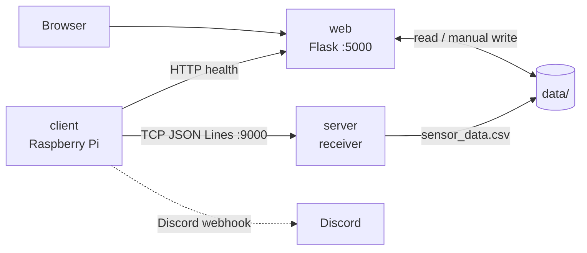

# Smart Environment Monitor

Raspberry Pi のセンサノードが温度・湿度・気圧・CO₂を測定し、TCP受信サーバーへ保存、Flaskダッシュボードで閲覧するモノレポです。測定データとヘルス履歴は共有CSVに保存しますが、`server` と `web` はWindows・Linuxの双方で動く共通のプロセス間ロックで安全に連携します。

## 主な機能

- DHT22、BME280、MH-Z19C の読み取り、完全なスナップショットだけのTCP送信とACK検証
- 重複排除されたCSV保存、複数クライアントの同時接続
- 検索、数値・日時ソート、ページング、グラフ、抽出結果全体の平均値、PNG保存
- センサー送信形式と同じ4測定値・桁数による手動登録、測定CSVと端末別ヘルス履歴CSVのダウンロード
- ヘルス状態、SSE更新、Discordの異常・復旧通知

## 構成



| ディレクトリ | 責務 |
| --- | --- |
| [`client/`](./client/README.md) | センサ読み取り、TCP送信、ヘルス送信、通知 |
| [`server/`](./server/README.md) | TCP受信、検証、重複排除、測定CSV保存 |
| [`web/`](./web/README.md) | Flask画面・API、検索、手動入力、ヘルス履歴 |
| [`common/`](./common) | 測定値検証、CSVスキーマ、クロスプラットフォームロック |
| [`data/`](./data) | 実行時CSV（内容はGit管理しない） |

## 使用技術・ポート

Python 3.10以上、Flask、Python標準ライブラリのTCPソケット、CSV、Server-Sent Eventsを使います。センサノードはRaspberry PiとDHT22、BME280、MH-Z19Cを使用します。

| サービス | ポート | 用途 |
| --- | --- | --- |
| `server` | TCP 9000 | センサ測定JSONとACK |
| `web` | HTTP 5000 | ダッシュボード、API、SSE |

## 全体セットアップと起動順

リポジトリのルートで実行します。先に `server`、次に `web`、最後に `client` を起動します。各`.env`はサンプル値のまま使わず、接続先と端末IDを環境に合わせて編集してください。

Linux / Raspberry Pi:

```bash
git clone https://github.com/IPUT-suzuki/smart-environment-monitor.git
cd smart-environment-monitor
python3 -m venv .venv
source .venv/bin/activate
python -m pip install --upgrade pip
pip install -r server/requirements.txt
pip install -r web/requirements.txt
pip install -r client/requirements.txt
cp server/.env.example server/.env
cp web/.env.example web/.env
cp client/.env.example client/.env
python -m server.main
```

別のターミナルで:

```bash
cd smart-environment-monitor
source .venv/bin/activate
python -m web.app
```

さらに別のターミナルで:

```bash
cd smart-environment-monitor
source .venv/bin/activate
python -m client.main --mode main
```

Windows PowerShell:

```powershell
git clone https://github.com/IPUT-suzuki/smart-environment-monitor.git
cd smart-environment-monitor
python -m venv .venv
.venv\Scripts\Activate.ps1
python -m pip install --upgrade pip
pip install -r server/requirements.txt
pip install -r web/requirements.txt
Copy-Item server/.env.example server/.env
Copy-Item web/.env.example web/.env
python -m server.main
```

Windows上ではセンサノードを実機モードで使わず、別のRaspberry Piで `client` を動かしてください。開発用のダミー送信は任意OSで次のように実行できます。

```powershell
python -m client.main --mode mock --iterations 10 --no-notify
```

## テスト

```bash
python -m unittest discover -s client/tests -v
python -m unittest discover -s server/tests -v
python -m unittest discover -s web/tests -v
python -m server.main --mode test --target roundtrip --count 10
```

`client`の実機センサー試験、Discord実送信、スマートフォン実機での操作は自動テストとは別です。手順は各サービスのREADMEと[テスト仕様](./docs/testing.md)を参照してください。

## 各システム

- [センサノード](./client/README.md)
- [データ受信サーバ](./server/README.md)
- [Webサーバ](./web/README.md)

## システム仕様

- [要求仕様](./docs/requirements.md)
- [システム構成](./docs/architecture.md)
- [データフロー](./docs/data-flow.md)
- [通信仕様](./docs/communication-specification.md)
- [CSV仕様](./docs/csv-specification.md)
- [Web API仕様](./web/docs/api.md)
- [テスト仕様](./docs/testing.md)
- [実装監査結果](./docs/implementation-audit.md)
- [リポジトリ構成](./docs/repository-structure.md)

## 既知の制約とセキュリティ

TCPとWeb APIには認証・TLSがありません。信頼できるLANだけで使用し、外部公開時はTLS終端、認証、ファイアウォールを追加してください。CSVは小規模な個人環境向けです。長期保管や高頻度・多数端末の運用ではDBと認証基盤への移行を検討してください。

実測CSV、`.env`、ロックディレクトリ、一時移行ファイルはGit管理しません。Webhookや実在IPをコミットしないでください。
