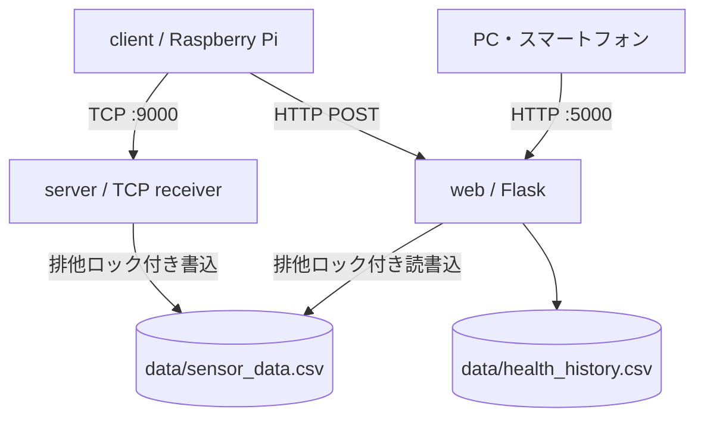

# システム構成

`client`は測定と通知だけを担当し、`server`は測定データの受信・永続化だけを担当します。`web`は測定CSVを読んで画面/APIを提供し、手動登録時だけ同じCSVへ書き込みます。CSV操作は全て`common/csv_lock.py`の原子的なロックディレクトリを用いるため、WindowsとLinuxの別プロセス間でも排他されます。

障害時の影響は限定されます。センサ読取失敗時はその周期の測定だけを捨て、次周期を継続します。受信サーバー障害時はクライアントが送信失敗をヘルスへ反映します。Web停止時も受信サーバーのCSV保存は継続します。
