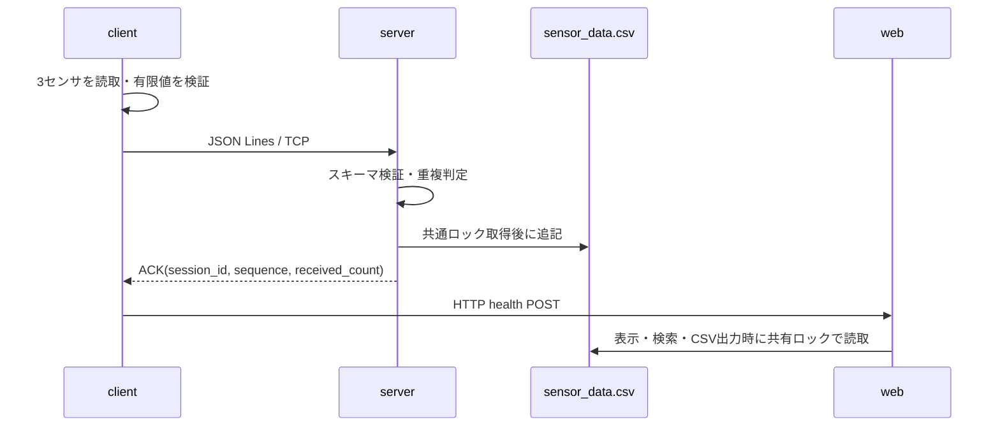

# データフロー

## 正常系

## 異常系

いずれかのセンサが欠損・非数値・NaN・Infinityなら測定JSONを作らず、該当センサだけを失敗として記録します。TCPエラーやACK不一致では送信失敗を記録します。連続失敗がしきい値に達したときだけDiscord通知し、復旧時は一度だけ通知します。CSVロックがタイムアウトしたWeb APIは503、TCPサーバーは再送可能なエラーACKを返します。
