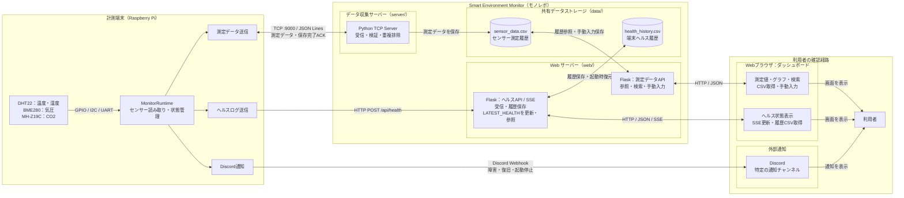
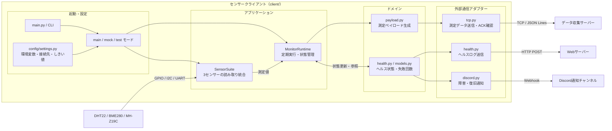
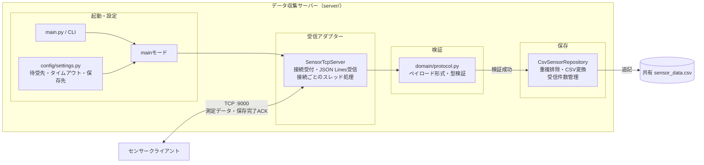
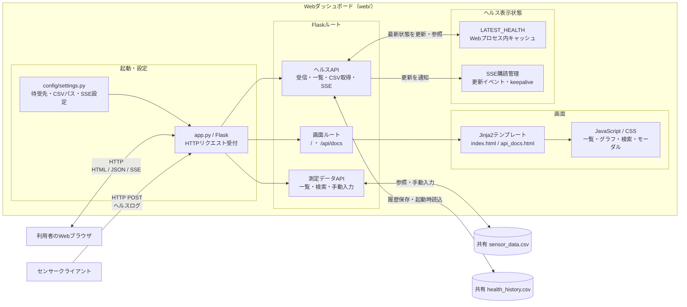

# Smart Environment Monitor システム構成図

## 1. クライアント構成（client/）

センサー読み取り、状態管理、外部送信を担当するRaspberry Pi側のプロセスです。

3センサーすべての読み取り成功時のみ、測定データをTCP送信します。

## 2. データ収集サーバー構成（server/）

TCPで測定データを受信し、検証・重複排除後に共有CSVへ保存します。

重複判定には `client_id`・`session_id`・`sequence` の組み合わせを使用します。

## 3. Webダッシュボード構成（web/）

測定データの表示・検索・手動入力と、ヘルスログの受信・表示を担当します。

Webサーバーとデータ収集サーバーは、同じ `sensor_data.csv` を参照します。`LATEST_HEALTH` は表示用キャッシュで、ヘルス履歴は `health_history.csv` に保存します。

## 運用上の前提

- `client/`・`server/`・`web/` は、それぞれ独立したプロセスとして起動します。
- `server/` と `web/` の `SENSOR_DATA_PATH` は、同じCSVを指定します。
- TCP受信とWeb APIは、信頼できるLAN内での利用を前提とします。
